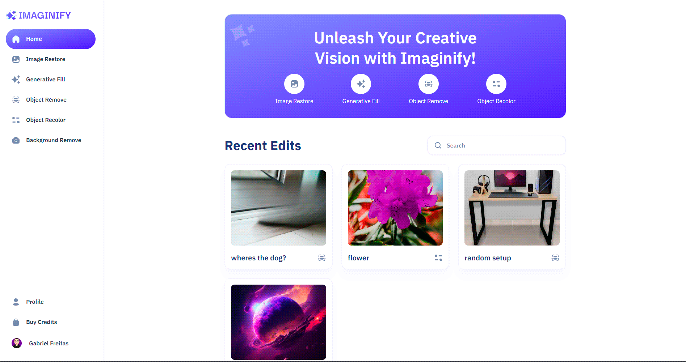

<h1 align="center">Imaginify</h1>

  
  
  
  
  
   
  
  
  
  

 

  
  

<h4 align="center">
  
  [Ver projeto](https://jsmastery-imaginify.vercel.app/)
</h4>

 

  <a href="#projeto">Sobre o projeto</a> •
  <a href="#tecnologias">Tecnologias</a>

## 💻 Sobre o projeto

Projeto Full-stack de um Saas integrado com inteligência artificial desenvolvido a partir do vídeo: https://youtu.be/Ahwoks_dawU.

Caso queira ver o projeto, clique [aqui](https://jsmastery-imaginify.vercel.app/).

## 🚀 Tecnologias

O projeto foi desenvolvido com as seguintes tecnologias:

- ReactJS
- NextJS
- Typescript
- Tailwind
- Shadcn UI
- Clerk
- Cloudinary
- Stripe
- MongoDB
